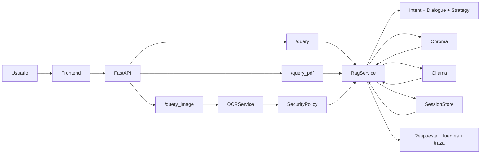

# CyberGuide

`CyberGuide` es un asistente conversacional local-first para alfabetización en ciberseguridad en contextos de pymes y autoempleo. Combina recuperación aumentada con generación, un corpus público persistente, análisis temporal de PDF y análisis de imagen con OCR primero.

Este repositorio contiene el código técnico del prototipo del TFG. Reúne el backend, el frontend, los ficheros de despliegue y los scripts principales de trabajo. Parte del material de redacción, validación manual y documentación privada se mantiene fuera de Git por decisión de alcance.

## Por qué hay tres README

Hay tres README porque cada uno responde a un nivel distinto de detalle:

1. `README.md` documenta el proyecto completo y sirve como puerta de entrada.
2. `backend/README.md` explica la API, la ingesta, el despliegue y la ejecución del servidor.
3. `frontend/README.md` describe la interfaz web, su estructura interna y su desarrollo.

La idea es evitar mezclar en un solo documento lo global con lo específico, pero manteniendo el mismo estilo visual y narrativo en los tres.

## Qué hace el proyecto

`CyberGuide` trabaja en tres modos principales:

- `Corpus chat`: preguntas sobre el corpus persistente ya ingerido en el vector store local.
- `PDF analysis`: subida de un PDF y consulta temporal sobre ese documento dentro de la sesión activa.
- `OCR-first image analysis`: subida de una captura o imagen con texto; el sistema extrae contenido con OCR y responde sobre esa base.

En escenarios sensibles, como pantallas de phishing, el backend aplica una capa de seguridad conservadora para evitar recomendaciones arriesgadas, como hacer clic en enlaces sospechosos o introducir credenciales.

## Arquitectura en una vista

El sistema está organizado alrededor de un runtime local:

- `FastAPI` sirve la API del backend y, en modo integrado, también la interfaz web.
- `Ollama` se ejecuta en la máquina anfitriona para generación y embeddings.
- `Chroma` guarda el índice vectorial persistente en local.
- `RapidOCR` se usa para extraer texto de imágenes.
- El frontend es una interfaz de chat ligera servida por el backend o en modo desarrollo separado.



### Flujo de una consulta

1. El usuario envía una pregunta, con o sin PDF o imagen.
2. El backend determina qué modo aplica.
3. Se recupera o extrae el contexto relevante.
4. Se construye un prompt acotado y fundamentado.
5. Se genera la respuesta y se devuelve con fuentes y traza.

## Estructura del repositorio

### Raíz

- `backend/`: aplicación `FastAPI`, orquestación RAG, OCR, seguridad, sesión y despliegue.
- `frontend/`: interfaz web en `React` + `Vite` con chat, adjuntos, trazas y fuentes.
- `scripts/`: utilidades de ingesta, evaluación y mantenimiento del corpus.
- `data/`: datos de trabajo locales, persistencia vectorial y artefactos de evaluación.
- `docs/`: notas técnicas, memoria de trabajo y documentación operativa del TFG.
- `repo-docs/`: documentación pública resumida de arquitectura, API y validación.

### Documentación pública complementaria

- [repo-docs/architecture.md](repo-docs/architecture.md): arquitectura y flujos principales.
- [repo-docs/api.md](repo-docs/api.md): contrato mínimo de la API pública.
- [repo-docs/validation.md](repo-docs/validation.md): batería manual de validación del MVP.

## Componentes principales

### Backend

- `backend/app/main.py`: entrada principal de `FastAPI` y rutas HTTP.
- `backend/app/services/rag.py`: orquestación principal de recuperación, curado de chunks y generación fundamentada.
- `backend/app/services/ingestion.py`: carga, parseo, fragmentación e ingesta de documentos.
- `backend/app/services/ocr_service.py`: extracción OCR de imágenes subidas.
- `backend/app/services/security_policy.py`: reglas conservadoras para casos sensibles.
- `backend/app/services/session_store.py`: estado de sesión en memoria para conversaciones multi-turno.
- `backend/app/services/vector_store.py`: integración con Chroma.
- `backend/app/services/ollama_client.py`: cliente local para chat y embeddings.
- `backend/app/prompting.py`: construcción de prompts y control de formato.
- `backend/requirements.txt`: dependencias Python.
- `backend/Dockerfile`: imagen de contenedor del backend.

### Frontend

- `frontend/src/pages/Index.tsx`: composición principal de la pantalla.
- `frontend/src/hooks/useChats.ts`: estado del chat, ramas, mensajes y llamadas a la API.
- `frontend/src/components/chat/`: componentes de chat, barra lateral, compositor, inspector y utilidades.
- `frontend/src/lib/api.ts`: cliente HTTP del backend.
- `frontend/src/index.css`: tokens globales y estilos base.
- `frontend/package.json`: scripts y dependencias del frontend.
- `frontend/vite.config.ts`: configuración de desarrollo y proxy local.

### Scripts

- `scripts/ingest_corpus.py`: construye o actualiza el corpus vectorial persistente.
- `scripts/generate_eval_dataset.py`: genera preguntas sintéticas de evaluación.
- `scripts/run_eval_benchmark.py`: envía el benchmark a la API local.
- `scripts/judge_eval_results.py`: puntúa resultados con el paso de juicio local.
- `scripts/eval_shared.py`: utilidades comunes del flujo de evaluación.

### Datos

- `data/raw/`: material de entrada local para ingesta.
- `data/processed/`: artefactos intermedios si se necesitan.
- `data/vectorstore/`: persistencia local del índice vectorial.
- `data/evals/`: salidas, resultados y resúmenes de evaluación.

## Puesta en marcha local

### Requisitos previos

Instala y ejecuta `Ollama` en la máquina anfitriona y descarga los modelos necesarios:

```bash
ollama pull llama3.1:8b
ollama pull bge-m3
```

Si quieres reconstruir el corpus persistente exactamente como se usó en el prototipo, también necesitas los PDFs locales referenciados por el flujo de ingesta. Esos ficheros no están incluidos en el repositorio.

### Entorno Python

```bash
cd backend
python3 -m venv .venv
source .venv/bin/activate
pip install -r requirements.txt
cp .env.example .env
```

### Ejecutar la aplicación

#### Solo backend

```bash
cd backend
source .venv/bin/activate
uvicorn app.main:app --reload --host 127.0.0.1 --port 8000
```

La API quedará disponible en:

- `http://127.0.0.1:8000`

#### Backend + frontend en desarrollo

En otra terminal:

```bash
cd frontend
npm install
npm run dev
```

La interfaz Vite quedará disponible en:

- `http://127.0.0.1:8080`

En este modo, el frontend proxifica `GET /health`, `POST /query`, `POST /query_pdf` y `POST /query_image` hacia el backend en el puerto `8000`.

#### Modo integrado con una sola entrada

Si quieres que el backend sirva directamente la interfaz web:

```bash
cd frontend
npm run build

cd ../backend
source .venv/bin/activate
uvicorn app.main:app --reload --host 127.0.0.1 --port 8000
```

En ese modo, `FastAPI` sirve `frontend/dist` desde:

- `http://127.0.0.1:8000/`

## Despliegue con Docker

El modelo recomendado es híbrido:

- `Ollama` corre en la máquina anfitriona.
- `CyberGuide` corre en Docker.

### Arrancar el contenedor

```bash
docker compose up --build
```

Con la imagen actual, el frontend se construye durante el build y el backend lo sirve desde `frontend/dist`, así que no hace falta un contenedor separado para la interfaz.

### Rellenar el vector store si está vacío

```bash
docker compose run --rm cyberguide-ingest
docker compose up -d cyberguide-app
```

Notas de despliegue importantes:

- la aplicación usa `host.docker.internal:11434` para llegar a `Ollama`,
- Chroma persiste en volúmenes Docker,
- el vector store no se recrea automáticamente si no reingestas el corpus,
- el backend puede servir el frontend compilado si `frontend/dist` está presente en el runtime.

## Ingesta de datos

El punto de entrada principal es `scripts/ingest_corpus.py`.

### Ingerir texto, Markdown o HTML desde `data/raw/`

```bash
PYTHONPATH=. python scripts/ingest_corpus.py
```

### Ingerir una carpeta personalizada

```bash
PYTHONPATH=. python scripts/ingest_corpus.py --root /absolute/path/to/documents
```

Si no tienes disponible la carpeta local `references/`, este modo es la vía prevista para reconstruir el vector store con tu propio conjunto documental.

### Ingerir PDFs locales de referencia

```bash
PYTHONPATH=. python scripts/ingest_corpus.py --root references/incibe-pdfs
```

Este camino es útil durante el desarrollo local cuando los PDF oficiales están almacenados fuera del contenido versionado.

## Evaluación y validación

Si quieres trabajar sobre la evaluación, los scripts principales son:

- `scripts/generate_eval_dataset.py`
- `scripts/run_eval_benchmark.py`
- `scripts/judge_eval_results.py`

### Flujo habitual de evaluación

```bash
python scripts/generate_eval_dataset.py
python scripts/run_eval_benchmark.py --base-url http://127.0.0.1:8013
python scripts/judge_eval_results.py
```

Este flujo:

1. construye un dataset sintético a partir del corpus local,
2. ejecuta los casos contra la API actual,
3. puntúa corrección, grounding y seguridad,
4. ayuda a detectar regresiones antes de tocar el sistema.

Los artefactos generados se guardan en:

- `data/evals/`

## Dónde tocar cada cosa

Si quieres...

- modificar recuperación, prompt o orquestación multimodal:
  ve a `backend/app/services/rag.py` y `backend/app/prompting.py`

- ajustar OCR:
  ve a `backend/app/services/ocr_service.py`

- modificar la política de seguridad para pantallas sospechosas:
  ve a `backend/app/services/security_policy.py`

- trabajar sobre la persistencia conversacional:
  ve a `backend/app/services/session_store.py`

- cambiar la ingesta:
  ve a `backend/app/services/ingestion.py` y `scripts/ingest_corpus.py`

- extender la evaluación:
  ve a `scripts/` y `data/evals/README.md`

- trabajar la interfaz de usuario:
  ve a `frontend/src/`, `frontend/index.html` y `frontend/vite.config.ts`

- ajustar el despliegue en contenedor:
  ve a `backend/Dockerfile` y `docker-compose.yml`

## Alcance actual

Este repositorio se centra en:

- un asistente acotado de alfabetización en ciberseguridad,
- ejecución local,
- grounding con fuentes públicas,
- comportamiento multimodal conservador.

No pretende ser:

- una plataforma completa de respuesta a incidentes,
- un copiloto genérico de ciberseguridad,
- ni un agente autónomo con uso libre de herramientas.

## Licencia

Este proyecto está licenciado bajo los términos de la MIT License.
