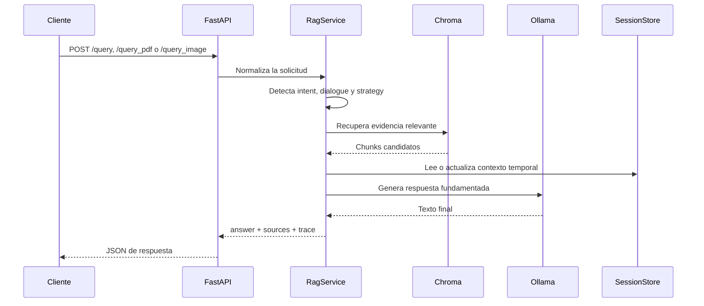

# Backend

Este directorio contiene la API de `CyberGuide`, la orquestación RAG, la lógica de OCR, el control de seguridad, la persistencia de sesión y los servicios de ingesta y vector store.

## Qué incluye esta carpeta

- `app/main.py`: entrada de `FastAPI` y rutas públicas.
- `app/services/rag.py`: coordinación principal de recuperación y generación.
- `app/services/ocr_service.py`: extracción de texto desde imágenes.
- `app/services/security_policy.py`: política de seguridad para casos sensibles.
- `app/services/session_store.py`: contexto conversacional temporal en memoria.
- `app/services/vector_store.py`: persistencia y consulta sobre Chroma.
- `app/services/ingestion.py`: carga y fragmentación del corpus.
- `app/services/ollama_client.py`: cliente local para chat y embeddings.
- `app/prompting.py`: construcción del prompt final.
- `requirements.txt`: dependencias Python.
- `Dockerfile`: imagen del servicio backend.

## Estructura local

```text
backend/
├── app/
│   ├── main.py
│   ├── prompting.py
│   ├── intents.py
│   ├── dialogue.py
│   ├── strategy.py
│   ├── schemas.py
│   └── services/
├── Dockerfile
├── README.md
└── requirements.txt
```

## Requisitos

- Python 3.11 o compatible con el entorno del proyecto.
- `Ollama` en la máquina anfitriona o accesible desde Docker.
- Modelos locales descargados: `llama3.1:8b` y `bge-m3`.
- Corpus o documentos fuente para la ingesta, si se quiere regenerar el vector store.

## Preparación del entorno

```bash
cd backend
python3 -m venv .venv
source .venv/bin/activate
pip install -r requirements.txt
cp .env.example .env
```

## Arranque local

### Solo API

```bash
cd backend
source .venv/bin/activate
uvicorn app.main:app --reload --host 127.0.0.1 --port 8000
```

La API quedará disponible en `http://127.0.0.1:8000`.

### Verificación rápida

```bash
curl -sS http://127.0.0.1:8000/health
```

La respuesta debe indicar `status: ok` y mostrar los modelos configurados.

## Flujo del backend



### Qué controla esta capa

- recuperación del corpus persistente,
- análisis temporal de PDF e imagen,
- política de seguridad para OCR sensible,
- persistencia conversacional dentro de la sesión,
- construcción del prompt y retorno de fuentes.

## Despliegue con Docker

La forma recomendada de ejecutar el proyecto es híbrida:

- `Ollama` corre fuera del contenedor, en la máquina anfitriona.
- `CyberGuide` corre dentro de Docker.

### Levantar el servicio

```bash
docker compose up --build
```

La imagen actual construye también el frontend durante el build y el backend sirve la SPA resultante desde `frontend/dist`, por lo que no hace falta un contenedor aparte para la interfaz.

### Ingesta antes del arranque, si el volumen está vacío

```bash
docker compose run --rm cyberguide-ingest
docker compose up -d cyberguide-app
```

## Ingesta del corpus

### Corpus local general

```bash
cd ..
PYTHONPATH=. python scripts/ingest_corpus.py
```

### Carpeta concreta

```bash
cd ..
PYTHONPATH=. python scripts/ingest_corpus.py --root /absolute/path/to/documents
```

### PDFs de referencia

```bash
cd ..
PYTHONPATH=. python scripts/ingest_corpus.py --root references/incibe-pdfs
```

Si la carpeta `references/` no está disponible, la opción de carpeta concreta es la vía prevista para reconstruir el vector store con tu propio material.

## Evaluación

Desde la raíz del proyecto:

```bash
python scripts/generate_eval_dataset.py
python scripts/run_eval_benchmark.py --base-url http://127.0.0.1:8013
python scripts/judge_eval_results.py
```

Este flujo genera el dataset, ejecuta el benchmark y puntúa corrección, grounding y seguridad.

## Contrato público relacionado

- [../repo-docs/architecture.md](../repo-docs/architecture.md)
- [../repo-docs/api.md](../repo-docs/api.md)
- [../repo-docs/validation.md](../repo-docs/validation.md)

## Notas de alcance

- La persistencia temporal de PDF e imagen depende de mantener la misma `session_id`.
- Chroma se guarda en volúmenes persistentes y no se recrea solo.
- La configuración usa `OLLAMA_BASE_URL=http://host.docker.internal:11434` en Docker.
