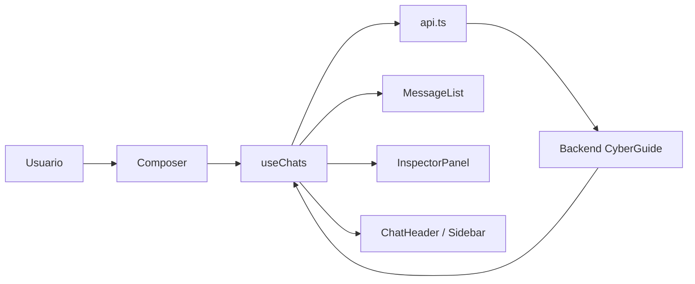

# Frontend

Este directorio contiene la interfaz web de `CyberGuide`. Su función es presentar la conversación, gestionar el estado visual del chat, adjuntar ficheros y mostrar fuentes, trazas y resultados de cada turno.

## Qué aporta esta capa

- Interfaz de chat para el corpus persistente.
- Subida de PDF para consultas temporales dentro de sesión.
- Subida de imágenes o capturas para análisis OCR-first.
- Persistencia local del historial en `localStorage`.
- Visualización de fuentes, trazas y estados del turno.

## Stack

- `React 18` + `TypeScript 5`.
- `Vite 5` para desarrollo y build.
- `Tailwind CSS 3` + `shadcn/ui` para UI base.
- `framer-motion` para animaciones de transición y layout.
- `react-markdown` + `remark-gfm` para renderizar respuestas del asistente.
- `Vitest` + Testing Library para pruebas.

## Estructura local

```text
frontend/
├── src/
│   ├── components/
│   │   └── chat/
│   ├── hooks/
│   ├── lib/
│   ├── pages/
│   ├── types/
│   ├── App.tsx
│   ├── index.css
│   └── main.tsx
├── package.json
├── vite.config.ts
└── README.md
```

## Desarrollo local

### Requisitos

- Node.js 18 o superior.
- Un gestor de paquetes: `npm`, `pnpm` o `bun`.
- Un backend de `CyberGuide` accesible por HTTP.

### Instalación

```bash
cd frontend
npm install
cp .env.example .env
```

Si utilizas otro gestor, sustituye `npm install` por el equivalente.

### Arranque en desarrollo

```bash
cd frontend
npm run dev
```

Por defecto Vite sirve la aplicación en `http://localhost:8080`. El puerto puede ajustarse en `vite.config.ts` o mediante la variable `PORT`.

### Build de producción

```bash
cd frontend
npm run build
npm run preview
```

El contenido de `dist/` es estático y puede servirse desde cualquier CDN o servidor estático.

## Variables de entorno

| Variable            | Por defecto             | Descripción                         |
|---------------------|-------------------------|-------------------------------------|
| `VITE_API_BASE_URL` | `http://127.0.0.1:8000` | URL base del backend de CyberGuide  |

Todas las variables expuestas al navegador deben empezar por `VITE_`.

## Scripts disponibles

| Comando         | Descripción                          |
|----------------|--------------------------------------|
| `npm run dev`   | Arranca el servidor de desarrollo    |
| `npm run build` | Genera el build optimizado en `dist/` |
| `npm run preview` | Sirve el build de producción       |
| `npm run lint`  | Ejecuta ESLint                       |
| `npm run test`  | Ejecuta los tests con Vitest         |

## Relación con el resto del proyecto

Esta capa no se distribuye como producto independiente. Forma parte del MVP completo y delega en el backend la recuperación, el OCR, la trazabilidad y la política de seguridad.

La interfaz se encarga de:

- gestionar el estado conversacional en `localStorage`,
- mantener visibles el chat activo y sus ramas,
- subir adjuntos a `POST /query_pdf` y `POST /query_image`,
- presentar fuentes, traza y contexto de forma comprensible.

## Flujo de la interfaz



### Qué conserva el frontend

- historial visible del chat,
- `session_id` activo entre turnos,
- ramas y conversaciones fijadas,
- fuentes, trazas y mensajes destacados,
- estado visual entre recargas mediante `localStorage`.

## Componentes principales

- `frontend/src/pages/Index.tsx`: composición principal de la página.
- `frontend/src/hooks/useChats.ts`: núcleo de estado para chats, ramas y llamadas a la API.
- `frontend/src/components/chat/`: sidebar, cabecera, composer, inspector y utilidades de chat.
- `frontend/src/lib/api.ts`: cliente HTTP del backend.
- `frontend/src/lib/title.ts`: heurística para titular conversaciones.
- `frontend/src/index.css`: tokens globales y estilos base.
- `frontend/src/App.tsx`: raíz de la aplicación.
- `frontend/vite.config.ts`: configuración de desarrollo y proxy.

## Documentación de apoyo

- [../repo-docs/architecture.md](../repo-docs/architecture.md)
- [../repo-docs/api.md](../repo-docs/api.md)
- [../repo-docs/validation.md](../repo-docs/validation.md)
