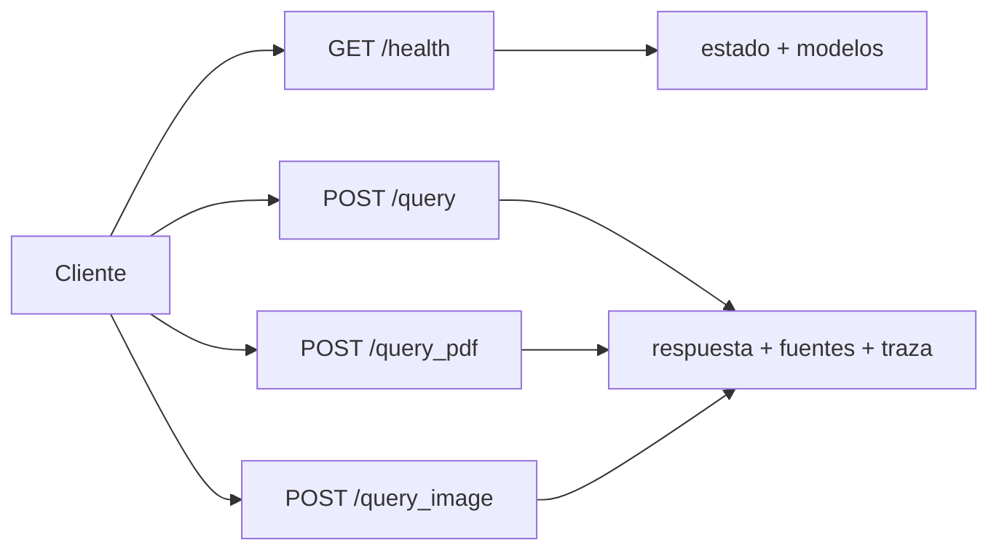
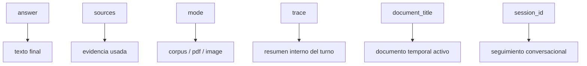

# Contrato público de la API

Este documento resume las rutas principales del backend y el formato mínimo esperado de sus peticiones y respuestas.

## Vista rápida

- `GET /health`: estado del servicio y modelos configurados.
- `POST /query`: consulta textual sobre el corpus persistente.
- `POST /query_pdf`: análisis temporal de un PDF dentro de la sesión activa.
- `POST /query_image`: análisis OCR-first de una imagen o captura.



## Base local habitual

- Backend: `http://127.0.0.1:8000`
- Documentación interactiva de FastAPI: `http://127.0.0.1:8000/docs`

## `GET /health`

Comprueba si el backend está levantado y qué modelos tiene configurados.

Ejemplo:

```bash
curl -sS http://127.0.0.1:8000/health
```

Respuesta típica:

```json
{
  "status": "ok",
  "app_name": "CyberGuide",
  "version": "0.1.0",
  "chat_model": "llama3.1:8b",
  "embed_model": "bge-m3:latest"
}
```

## `POST /query`

Consulta textual sobre el corpus persistente.

Ejemplo:

```bash
curl -sS http://127.0.0.1:8000/query \
  -H 'Content-Type: application/json' \
  -d '{
    "message": "Mejorar mis contraseñas",
    "top_k": 4,
    "session_id": "demo-001"
  }'
```

Payload mínimo:

```json
{
  "message": "Texto de la consulta",
  "top_k": 4,
  "session_id": "opcional"
}
```

## `POST /query_pdf`

Analiza un PDF temporal dentro de la sesión activa sin contaminar el corpus persistente.

Ejemplo:

```bash
curl -sS http://127.0.0.1:8000/query_pdf \
  -F 'message=Resume el documento' \
  -F 'session_id=pdf-001' \
  -F 'file=@/ruta/al/archivo.pdf'
```

## `POST /query_image`

Analiza una imagen o captura con OCR-first.

Ejemplo:

```bash
curl -sS http://127.0.0.1:8000/query_image \
  -F 'message=¿Qué harías aquí?' \
  -F 'session_id=img-001' \
  -F 'file=@/ruta/a/la/captura.png'
```

## Estructura general de respuesta

Las tres rutas devuelven una estructura similar:

```json
{
  "answer": "Respuesta final del asistente",
  "sources": [],
  "model": "llama3.1:8b",
  "mode": "corpus",
  "session_id": "demo-001",
  "document_title": null,
  "trace": {}
}
```

Campos importantes:

- `answer`: texto final mostrado al usuario.
- `sources`: evidencia recuperada que respalda la respuesta.
- `mode`: `corpus`, `pdf` o `image`.
- `session_id`: identificador necesario para follow-ups.
- `document_title`: nombre del PDF o la imagen activos cuando existe contexto temporal.
- `trace`: resumen interpretable del recorrido interno del turno.

### Lectura rápida del payload



## Qué aporta la traza

La traza no es un log crudo, sino una representación resumida del proceso. Suele incluir:

- modo de consulta,
- candidatos recuperados y candidatos curados,
- documento activo,
- número de turnos previos,
- intención detectada,
- estrategia de respuesta,
- tiempos aproximados,
- si hubo `safety_mode`,
- y señales de riesgo cuando aplica.

## Limitaciones conocidas del contrato

- La persistencia temporal de PDF e imagen depende de mantener la misma `session_id`.
- Si el backend se reinicia, el historial visible puede seguir en el frontend, pero el contexto temporal del servidor puede perderse.
- La API está pensada para el MVP del TFG; puede evolucionar si cambian necesidades de producto o de evaluación.
