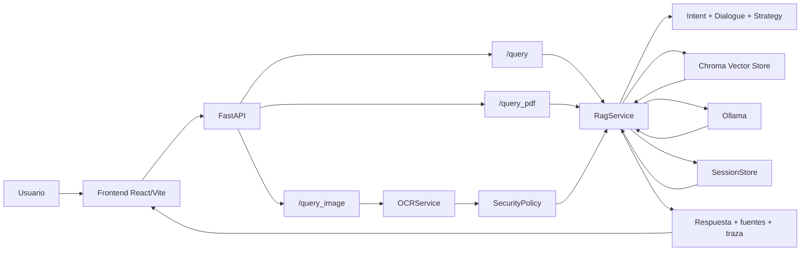
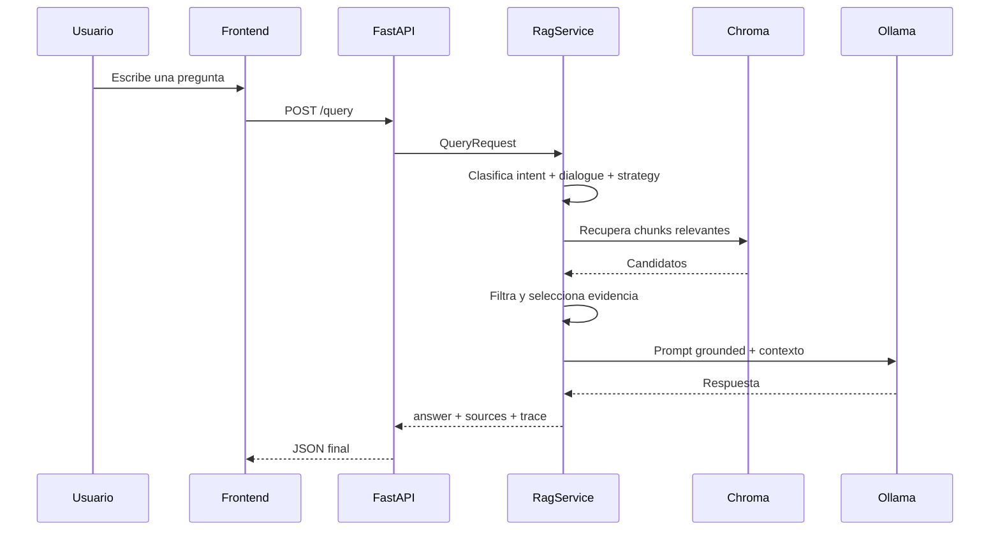

# Arquitectura de CyberGuide

Este documento resume la arquitectura pública del prototipo y cómo se conectan sus piezas principales.

## Mapa rápido

- `Frontend React/Vite`: interacción visual y persistencia de conversación en el navegador.
- `FastAPI`: rutas públicas y orquestación HTTP.
- `RagService`: recuperación, curado de evidencia y generación fundamentada.
- `OCRService` + `SecurityPolicy`: análisis de imagen con comportamiento conservador.
- `Chroma` + `Ollama` + `SessionStore`: recuperación, generación y contexto temporal.

## Visión general

CyberGuide se apoya en una arquitectura local-first con tres rutas principales de consulta:

- `POST /query`: consulta textual sobre corpus persistente.
- `POST /query_pdf`: análisis temporal de un PDF subido por el usuario.
- `POST /query_image`: análisis OCR-first de una imagen o captura.

## Diagrama general

## Componentes principales

### Frontend

La interfaz web está desarrollada con `React` y `Vite`. Su papel no es solo mostrar mensajes, sino también:

- mantener el historial visible del chat en `localStorage`,
- conservar el `session_id` activo entre turnos,
- enviar adjuntos a las rutas de PDF e imagen,
- mostrar fuentes y traza interna del turno,
- gestionar ramas, mensajes destacados, chats fijados y borrado múltiple.

Archivos clave:

- `frontend/src/pages/Index.tsx`
- `frontend/src/hooks/useChats.ts`
- `frontend/src/components/chat/`
- `frontend/src/lib/api.ts`

### Backend API

El backend está desarrollado con `FastAPI` y expone las rutas HTTP principales del sistema.

Archivos clave:

- `backend/app/main.py`
- `backend/app/schemas.py`

### Capa de razonamiento conversacional

Antes de recuperar evidencia o generar la respuesta, el backend resuelve tres decisiones:

- `intent`: qué tipo de petición ha hecho el usuario,
- `dialogue goal`: qué espera recibir en este turno,
- `strategy`: si conviene responder, recuperar, pedir aclaración o reutilizar contexto previo.

Archivos clave:

- `backend/app/intents.py`
- `backend/app/dialogue.py`
- `backend/app/strategy.py`

### Orquestación RAG

La lógica principal vive en `backend/app/services/rag.py`. Ahí se coordinan:

- recuperación desde el corpus persistente,
- curado de chunks,
- reutilización de contexto previo cuando procede,
- construcción del prompt,
- llamada a `Ollama`,
- pulido final de la respuesta,
- y generación de traza para frontend y evaluación.

### Recuperación y persistencia

El corpus persistente se almacena en `Chroma`. Cada documento se fragmenta, se vectoriza y se consulta por similitud semántica en tiempo de respuesta.

Archivos clave:

- `backend/app/services/vector_store.py`
- `backend/app/services/ingestion.py`

### OCR y seguridad

Las imágenes se procesan con `RapidOCR`. Si el texto extraído contiene señales sensibles de acceso, verificación o clic, se activa una política explícita de seguridad que estrecha deliberadamente la respuesta.

Archivos clave:

- `backend/app/services/ocr_service.py`
- `backend/app/services/security_policy.py`

### Sesión y contexto temporal

El historial reciente y los documentos temporales de PDF o imagen se conservan en memoria de servidor mediante `SessionStore`. Esto permite follow-ups dentro de la misma sesión, aunque esa persistencia no sobrevive al reinicio del backend.

Archivo clave:

- `backend/app/services/session_store.py`

## Flujo de una consulta textual

## Limitaciones arquitectónicas actuales

- El corpus sigue siendo acotado y no cubre todo el dominio de la ciberseguridad.
- La persistencia temporal de PDF e imagen depende de memoria de servidor.
- La validación principal del backend se ha apoyado en benchmark y pruebas manuales, no en usuarios finales.
- El modo imagen es `OCR-first`; no usa todavía un modelo de visión generalista.
