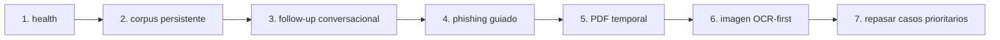
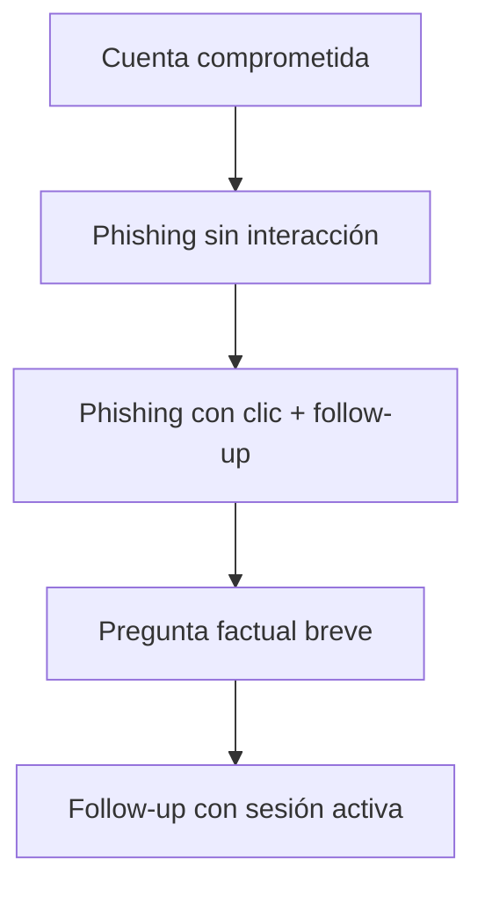

# Validación manual recomendada

Este documento reúne una batería pública y breve de comprobaciones para validar el MVP sin depender de materiales privados del proyecto.

## Flujo de validación



La idea es validar primero que el backend está vivo, después que responde bien sobre corpus, y luego que conserva contexto y aplica la política de seguridad en casos sensibles.

## 1. Comprobación básica del backend

```bash
curl -sS http://127.0.0.1:8000/health
```

Debe responder con estado `ok` y mostrar los modelos configurados.

## 2. Consulta textual sobre corpus persistente

```bash
curl -sS http://127.0.0.1:8000/query \
  -H 'Content-Type: application/json' \
  -d '{
    "message": "¿Cuántos caracteres deben contener las contraseñas para ser robustas?",
    "top_k": 4,
    "session_id": "val-001"
  }'
```

Comprobar:

- que responde con una idea concreta y no demasiado abierta,
- que devuelve fuentes,
- que la traza es coherente con el modo `corpus`.

## 3. Follow-up conversacional

Primer turno:

```bash
curl -sS http://127.0.0.1:8000/query \
  -H 'Content-Type: application/json' \
  -d '{
    "message": "si ya me han hackeado la cuenta de correo electrónico qué hago?",
    "top_k": 4,
    "session_id": "val-002"
  }'
```

Segundo turno con la misma `session_id`:

```bash
curl -sS http://127.0.0.1:8000/query \
  -H 'Content-Type: application/json' \
  -d '{
    "message": "pero no puedo acceder a él, me han cambiado la contraseña",
    "top_k": 4,
    "session_id": "val-002"
  }'
```

Comprobar:

- que el segundo turno no repite sin más “cambia la contraseña”,
- que pasa a recuperación oficial, revisión de métodos de recuperación y soporte o TI.

## 4. Caso de phishing guiado

```bash
curl -sS http://127.0.0.1:8000/query \
  -H 'Content-Type: application/json' \
  -d '{
    "message": "me ha llegado un correo que dice que valide mi cuenta y haga clic en un enlace",
    "top_k": 4,
    "session_id": "val-003"
  }'
```

Comprobar:

- que lo trata como posible phishing,
- que no recomienda hacer clic ni responder,
- que propone verificación por canal oficial.

## 5. PDF temporal

```bash
curl -sS http://127.0.0.1:8000/query_pdf \
  -F 'message=Resume el documento' \
  -F 'session_id=val-pdf-001' \
  -F 'file=@/ruta/al/documento.pdf'
```

Comprobar:

- que el documento no entra en el corpus persistente,
- que el título del documento aparece en la respuesta,
- que los follow-ups posteriores funcionan con la misma `session_id`.

## 6. Imagen OCR-first

```bash
curl -sS http://127.0.0.1:8000/query_image \
  -F 'message=¿Qué harías aquí?' \
  -F 'session_id=val-img-001' \
  -F 'file=@/ruta/a/la/captura.png'
```

Comprobar:

- que se extrae texto suficiente para responder,
- que la respuesta sigue siendo textual,
- que en casos sensibles puede activarse `safety_mode`.

## 7. Casos prioritarios antes de una entrega

Si hay poco tiempo, conviene repetir siempre estos casos:

1. Cuenta comprometida con pérdida de acceso.
2. Posible phishing sin interacción.
3. Phishing con clic y follow-up.
4. Pregunta factual corta sobre contraseñas.
5. Follow-up que dependa de mantener la sesión activa.

### Orden recomendado



## 8. Qué límites siguen siendo normales en este MVP

- Cobertura parcial del dominio por corpus todavía acotado.
- Persistencia temporal de PDF e imagen dependiente de memoria de servidor.
- Calidad OCR condicionada por la limpieza del texto de entrada.
- Validación principal basada en benchmark y pruebas manuales, no en usuarios finales externos.
